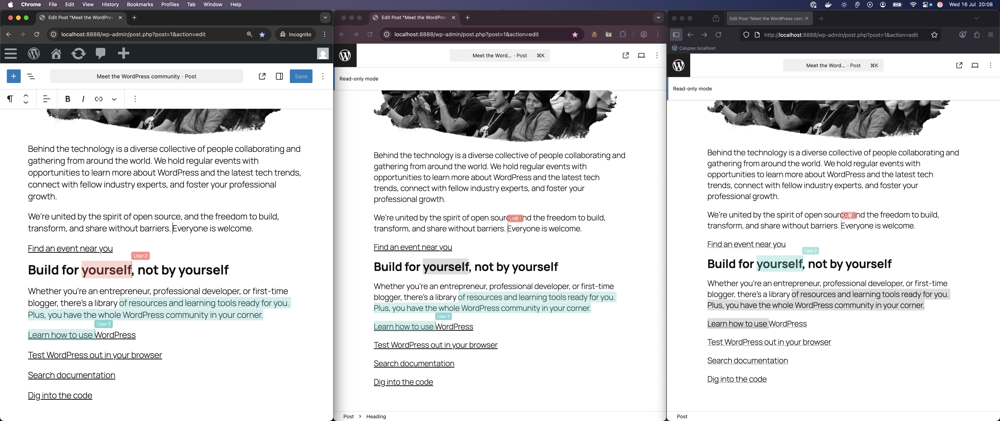

# Gutenberg Collaborative Editing

- Contributors: wordpressdotorg, ashfame
- Tags: gutenberg, collaborative-editing
- Requires at least: 6.0
- Tested up to: 6.8.2
- Requires PHP: 7.4
- License: [GPLv2](http://www.gnu.org/licenses/gpl-2.0.html)
- Stable tag: 0.0.1
- GitHub Plugin URI: https://github.com/ashfame/gutenberg-collaborative-editing

Enable collaborative editing in Gutenberg

## Description
Enable collaborative editing in Gutenberg.

## Screenshots

## How to run this locally?
- After cloning the GIT repo locally, run `nvm use`, `npm install`
- Run `npm run build` once or can also run `npm run start`
- Run `npm run wp-env start` (you will need docker running).
- Login into WordPress ([http://localhost:8888/wp-admin](http://localhost:8888/wp-admin)) with username `admin` and password as `password`
- Create one or more users & login from these user accounts in separate browser instances.
- Edit the same post for editing. First user will get edit access as usual and other users would be able to follow along in a read-only manner.
- Being on a call, these users can meaningfully participate already as of today.

## Frequently Asked Questions

### How do I use it?
Install this plugin and have more than one user edit the same post or page.

### Can I programmatically control what post or page have this enabled?
Not yet. I need to figure out a good way to enable that. But eventually I would like it to be configurable as follows:

~~~php
// functions.php
add_filter( 'gutenberg_collabrative_editing_enabled', function ( $post, $user_ids_collaborating, $user_id_initiating_collaboration ) {
    // Add logic here
	return $true;
} );
~~~

## Changelog

### 0.0.1

- Initial dev release
