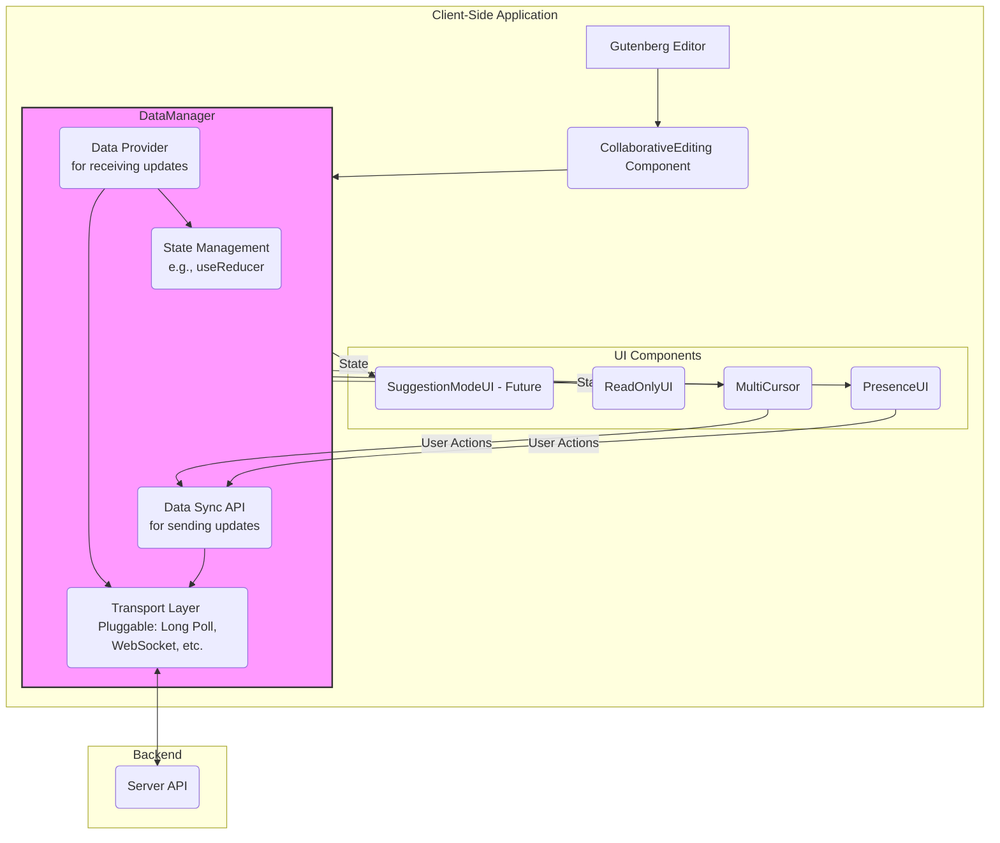

# Collaborative Editing Plugin Architecture

This document outlines the architecture for the Gutenberg Collaborative Editing plugin. It is designed to be a living document that guides development and refactoring efforts. The core goals of this architecture are modularity, scalability, and a clear separation of concerns to support current and future collaborative features.

## 1. High-Level Overview

The architecture is centered around a `DataManager` model. This model acts as the central hub for all data communication with the backend, managing both incoming data (state updates) and outgoing data (user actions).

UI components are kept "dumb," meaning they are only responsible for rendering the state they are given via props and reporting user actions back to the `DataManager`. They do not contain any data-fetching or state management logic themselves.

This approach decouples the UI from the data layer, allowing either to be changed independently. For example, we can change the data transport mechanism from long-polling to WebSockets without making any changes to the UI components.

### Architecture Diagram



## 2. Core Components & Concepts

### 2.1. `CollaborativeEditing` Component

This is the top-level React component for the plugin, injected into the Gutenberg editor.

-   **Responsibility**: To orchestrate the entire collaborative UI.
-   **Logic**: It will use the main `useDataManager` hook to get the shared state and the functions to update it. It will then pass this state down to its child UI components.
-   **Example**:
    ```javascript
    import { useDataManager } from './hooks/useDataManager';
    import { PresenceUI } from './components/PresenceUI';
    import { ReadOnlyUI } from './components/ReadOnlyUI';

    export const CollaborativeEditing = () => {
        const { state } = useDataManager({ transport: 'long-polling' });

        return (
            <>
                <PresenceUI awarenessState={state.awareness} />
                <ReadOnlyUI isReadOnly={state.isReadOnly} />
                {/* Future components would be added here */}
            </>
        );
    };
    ```

### 2.2. UI Components (`PresenceUI`, `MultiCursor`, `AvatarList`, etc.)

These are pure, presentational components.

-   **Responsibility**: To render a piece of the UI based on the props they receive. They should be stateless wherever possible.
-   **Data Flow**: They receive state as props from `CollaborativeEditing`. If they need to trigger a state change (e.g., user moves the cursor), they call a function (also received via props) from the `DataManager`'s API.
-   **Example (`MultiCursor`):**
    ```javascript
    // Receives syncAwareness function to report its own state
    export const MultiCursor = ({ awarenessState, syncAwareness }) => {
        // Logic to update its own cursor position and call syncAwareness
        // ...

        // Renders the cursors of other users from awarenessState
        return (
            <>
                {Object.values(awarenessState.users).map(user => (
                    <Cursor key={user.id} data={user.cursor} />
                ))}
            </>
        )
    };
    ```

#### 2.2.1 MultiCursor

Don't modify the MultiCursor class, just report issues if you notice any in its logic (these would need to be tested separately before accepting). Just make changes how its used in useMultiCursor.js

## 3. The `DataManager`

The `DataManager` is not a single object but a collection of hooks and functions that form the data layer of the application. The primary entry point will be the `useDataManager` hook.

### 3.1. `useDataManager` Hook

This hook is the single source of truth for the client application.

-   **Signature**: `useDataManager(config)`
-   **Parameters**:
    -   `config` (Object): An object for configuration. The most important property is `transport`, which specifies which transport layer to use (e.g., `'long-polling'`).
-   **Returns**: An object containing:
    -   `state` (Object): The current shared state of the collaborative session.
    -   `syncAwareness` (Function): A function to send the user's awareness state (cursor, etc.) to the server.
    -   `syncContent` (Function): A function for the lock-holder to send content changes to the server.

### 3.2. State Management

The internal state of the `DataManager` will be managed by a `useReducer` hook for predictable state transitions.

-   **State Shape**:
    ```typescript
    interface CollaborativeState {
        isReadOnly: boolean;
        isSynced: boolean;
        lockHolder: User | null;
        awareness: {
            [userId: string]: AwarenessInfo;
        };
        // ... other state properties
    }

    interface AwarenessInfo {
        user: User;
        cursor: {
            x: number;
            y: number;
            selection?: any;
        };
        // ... other awareness properties
    }
    ```

### 3.3. Data Submission (`Data Sync`)

This is the "outgoing" part of the `DataManager`. It provides a stable API for the UI to send data to the backend, regardless of the transport used.

-   **API Functions**:
    -   `syncAwareness(awarenessState)`: Takes the current user's awareness state and sends it via the active transport.
    -   `syncContent(content)`: Takes the new post content and sends it.
    -   `requestLock()`: Attempts to gain the editing lock for the post.

## 4. The Transport Layer

This is a critical abstraction that makes the system flexible. We define a common interface that every transport mechanism must implement.

### 4.1. Transport Interface

A transport is an object that conforms to the following interface:

```typescript
interface ITransport {
    /**
     * Initializes the connection to the server.
     * @param onData A callback function that the transport will invoke with new data from the server.
     * @param initialData Any data needed to start the connection (e.g., post ID, user token).
     */
    connect(onData: (data: any) => void, initialData: any): void;

    /**
     * Sends data to the server.
     * @param data The payload to send.
     */
    send(data: any): Promise<void>;

    /**
     * Terminates the connection.
     */
    disconnect(): void;
}
```

### 4.2. Transport Implementations

We can create several implementations of this interface.

-   **`LongPollingTransport.js`**: Uses `fetch` to repeatedly poll an endpoint. The `send` method will be a separate `fetch` POST request.
-   **`FilePollingTransport.js`** (For basic hosting): Repeatedly fetches a static JSON file. The `send` method would post to a PHP script that updates the file.
-   **`WebSocketTransport.js`** (For advanced hosting): Uses a WebSocket for real-time, bidirectional communication.

The `DataManager` will be responsible for instantiating the correct transport based on the configuration passed to it.

## 5. Refactoring Plan

To transition the existing codebase to this architecture, the following steps should be taken:

1.  **Create `architecture.md`**: Establish this document as the source of truth. (Done)
2.  **Implement the Transport Interface**:
    -   Create a new directory `src/transports`.
    -   Define the `ITransport` interface.
    -   Refactor the existing polling logic from `usePollingForUpdates.js` into a new `src/transports/LongPollingTransport.js` that implements the interface.
3.  **Create the `DataManager`**:
    -   Create a new `src/hooks/useDataManager.js`.
    -   Implement the `useReducer` for state management.
    -   Implement the logic to instantiate and use the configured transport.
    -   Expose the `state` and the `sync` functions.
4.  **Refactor `CollaborativeEditing.js`**:
    -   Update it to use the `useDataManager` hook.
    -   Remove any direct calls to data-fetching hooks.
    -   Pass state and sync functions down to child components as props.
5.  **Refactor UI Components**:
    -   Modify `MultiCursor` and other components to be "dumb." They should expect all data and functions via props.
    -   Remove `useCollaborativeEditingData`, `useContentSync`, etc., from these components.
6.  **Integrate Existing UI**:
    -   Create the `PresenceUI` component.
    -   Move `AvatarList` and the refactored `MultiCursor` inside `PresenceUI`.
    -   Ensure the `awarenessState` is correctly passed down and rendered.
7.  **Cleanup**:
    -   Remove the old, now unused hooks (`usePollingForUpdates`, `useAwarenessSync`, `useContentSync`).
    -   Delete any other redundant code.
