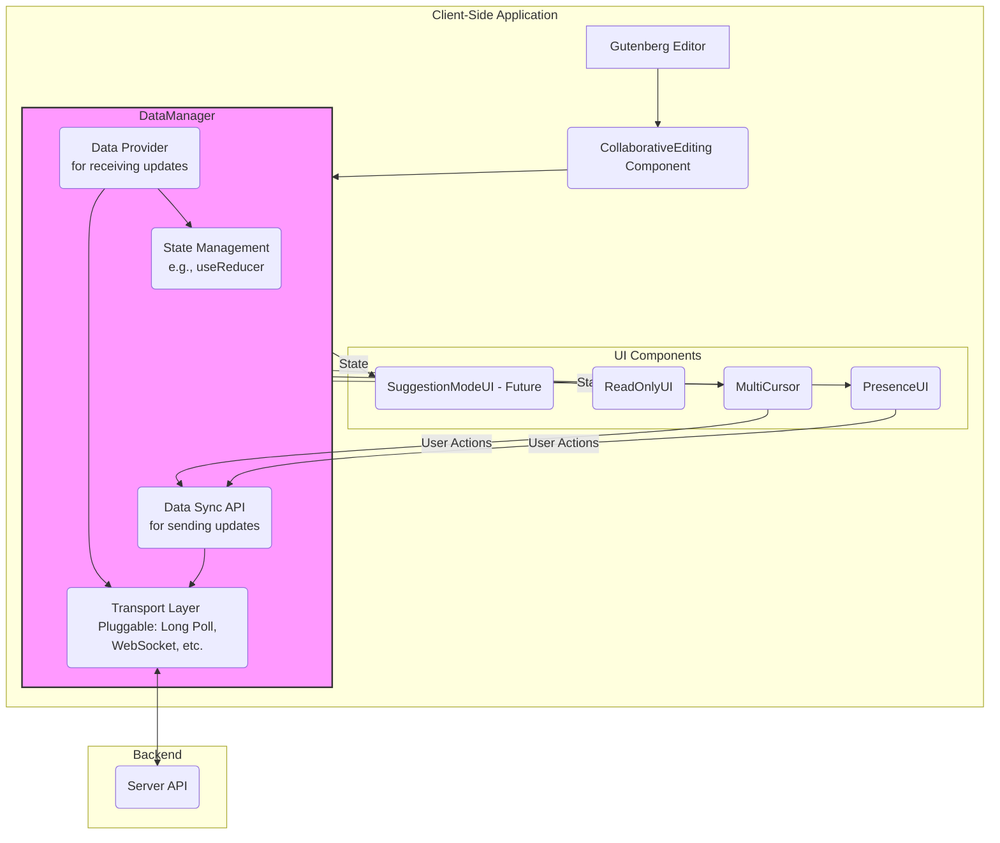

# Collaborative Editing Plugin Architecture

This document outlines the architecture for the Gutenberg Collaborative Editing plugin. It is designed to be a living document that guides development and refactoring efforts. The core goals of this architecture are modularity, scalability, and a clear separation of concerns to support current and future collaborative features.

## 1. High-Level Overview

For collaborative editing, we are offering two different modes as of today.
One is "Read-only Follow" mode, where one user makes the edit and others participate in a read-only view of the content being modified in realtime.
Another is "Block-level Locks" mode, where a user acquires lock on the block they are engaging with so that only they can edit it.

To sync the content between multiple users/clients, we maintain a shadow copy of the post content, which is kept updated as users/clients make their modifications.
This is currently saved as transients, but will be moved to a persistent storage in the future.
This shadow copy is served to all clients as it gets modified, acting as the source of truth.

As of today, on the basis of collaboration mode, users editing content can either send the full copy of the modified content to the server (as in Read-only Follow mode), or only send the content of the particular block that they are engaged in (as in Block-level Locks mode).
To receive content updates, users received the full updated content at that given time, so a client always has a fully intact copy of the post.

In the future, both modes would merge into a user level mode, where users collaborate with edit intention by default, but can switch to a "Viewing" mode, which would be equivalent to the existing "Read-only Follow" mode.
This would encourage refactoring of the content sending mechanism, and just sending the block level copy would become the only way to send content updates.

On the client side, the client parses the entire content into blocks and then overwrites the content of all blocks except the one it is currently editing. And as you can imagine for "Read-only Follow" mode, we overwrite the entire post/page content with the new content.

All the communication happens via a Transport layer, which is designed to be configurable.
So, it can be either a long-polling mechanism, or just a static file requested repeatedly or a WebSocket mechanism.

Transport layer also allows transmission of the user's awareness state (cursor state along with user details) to the server.
Using this, we render cursors of other users on the page, which is done by an overlay technique where we draw fake cursors as per their cursor state.

As of today, we only have a long-polling mechanism as our transport layer, which uses AJAX calls to submit data, and a long polling request to receive data.
This allows us to cater to every kind of hosting environment. Long polling enables us to respond very quickly as the shadow copy is updated.

### Architecture Diagram



## 2. Core Components & Concepts

The architecture is centered around a `DataManager` model.
This model acts as the central hub for all data communication with the backend, managing both incoming data (state updates) and outgoing data (user actions).

UI components are kept "dumb," meaning they are only responsible for rendering the state they are given via props and reporting user actions back to the `DataManager`.
They do not contain any data-fetching or state management logic themselves.

This approach decouples the UI from the data layer, allowing either to be changed independently.

### 2.1. `CollaborativeEditing` Component

This is the top-level React component, registered as a plugin in the Gutenberg editor.

-   **Responsibility**: Orchestrate the entire collaborative experience.
-   **Logic**: It will use the main `useDataManager` hook to get the shared state and the functions to update it. It then passes this state down to its child UI components. It also uses specialized hooks like `useCSSClassManager` and `useGutenbergEditorControls` to manage the UI state of the editor itself, such as disabling controls when in read-only mode.

### 2.2. UI Components (`PresenceUI`, `MultiCursor`, `AvatarList`, etc.)

These are pure, presentational components.

-   **Responsibility**: To render a piece of the UI based on the props they receive. They should be stateless wherever possible.
-   **Data Flow**: They receive state as props from `CollaborativeEditing`. If they need to trigger a state change (e.g., user moves the cursor), they call a function (also received via props) that originates from one of the data manager hooks.

#### 2.2.1 MultiCursor

Don't modify the MultiCursor class, just report issues if you notice any in its logic (these would need to be tested separately before accepting). Just make changes how its used in useMultiCursor.js

## 3. The `DataManager`

The `DataManager` is not a single object but a concept representing the data layer of the application. It's implemented as a collection of custom React hooks that work together to manage state, synchronization, and communication with the backend. The primary entry point to this data layer is the `useDataManager` hook.

This modular approach with multiple hooks allows for a clear separation of concerns, making the system easier to maintain and extend. Each hook has a specific responsibility.

### 3.1. `useDataManager` Hook

This hook acts as the central orchestrator for the client-side collaborative editing experience. It doesn't contain all the logic itself but rather integrates and coordinates the other specialized hooks.

-   **Responsibility**:
    -   Initialize and manage the transport layer via `useTransportManager`.
    -   Use `useGutenbergState` to get data from the editor.
    -   Coordinate data syncing with `useContentSyncer`.
    -   Manage the central awareness state.
    -   Provide the `CollaborativeEditing` component with all the necessary state and functions.

### 3.2. Specialized Hooks

These hooks encapsulate specific pieces of functionality. `useDataManager` uses them to build the complete collaborative experience.

-   **`useGutenbergState`**: Subscribes to the Gutenberg data store to get real-time information about the editor's state, such as post content, block list, and cursor position.

-   **`useTransportManager`**: Manages the transport layer (e.g., long-polling). It provides a simple `send` function and an `onDataReceived` callback, abstracting away the specifics of the communication protocol.

-   **`useContentSyncer`**: Decides when to send content updates to the server. It tracks local changes and uses the transport layer to send them.

-   **`useCollaborationMode`**: Determines the current collaboration mode (e.g., 'READ-ONLY-FOLLOW' or 'BLOCK-LEVEL-LOCKS').

-   **`useDerivedAwarenessState`**: Takes the raw awareness data from all connected users and computes useful derived state, such as lists of active and inactive users.

-   **`useProactiveStalenessCheck`**: Periodically checks for users who might have disconnected without cleanly notifying the server (e.g., closed browser tab) and marks them as stale.

-   **`useBlockLocking`**: Implements the logic for block-level locking, preventing multiple users from editing the same block simultaneously.

-   **`useCSSClassManager`**: Manages CSS classes applied to the editor's body to visually reflect the collaboration state (e.g., adding a class to indicate other users are present).

-   **`useGutenbergEditorControls`**: Enables or disables Gutenberg's UI controls based on the user's editing privileges (e.g., disables saving and publishing for users who are not the lock holder in read-only mode).

### 3.3. State Management

The internal state within `useDataManager` is managed by a `useReducer` hook for predictable state transitions related to awareness. However, much of the state is decentralized and managed within the specialized hooks or derived from the Gutenberg data store.

### 3.4. Data Submission (`Data Sync`)

This is the "outgoing" part of the `DataManager`. The `useTransportManager` provides a stable API for other hooks (like `useContentSyncer`) to send data to the backend, regardless of the transport used.

-   **API Functions (exposed by hooks)**:
    -   `syncAwareness(awarenessState)`: Called to send the user's current awareness state (e.g., cursor position) to the server.
    -   `syncContent(content)`: Called by `useContentSyncer` to send content changes.

## 4. The Transport Layer

This is a critical abstraction that makes the system flexible. We define a common interface that every transport mechanism must implement.

### 4.1. Transport Interface

A transport is an object that conforms to the following interface:

```typescript
interface ITransport {
    /**
     * Initializes the connection to the server.
     * @param onData A callback function that the transport will invoke with new data from the server.
     * @param initialData Any data needed to start the connection (e.g., post ID, user token).
     */
    connect(onData: (data: any) => void, initialData: any): void;

    /**
     * Sends data to the server.
     * @param data The payload to send.
     */
    send(data: any): Promise<void>;

    /**
     * Terminates the connection.
     */
    disconnect(): void;
}
```

### 4.2. Transport Implementations

We can create several implementations of this interface.

-   **`LongPollingTransport.js`**: Uses `fetch` to repeatedly poll an endpoint. The `send` method will be a separate `fetch` POST request.
-   **`FilePollingTransport.js`** (For basic hosting): Repeatedly fetches a static JSON file. The `send` method would post to a PHP script that updates the file.
-   **`WebSocketTransport.js`** (For advanced hosting): Uses a WebSocket for real-time, bidirectional communication.

The `DataManager` will be responsible for instantiating the correct transport based on the configuration passed to it.

## 5. Refactoring Plan


